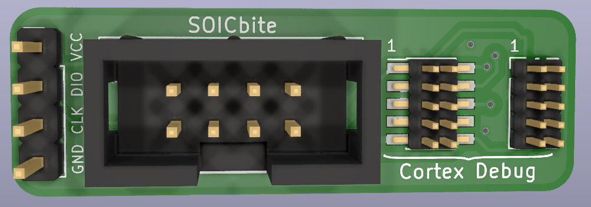
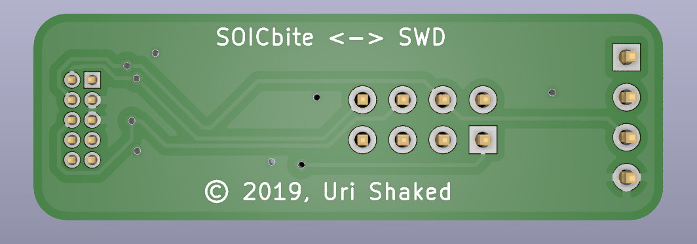
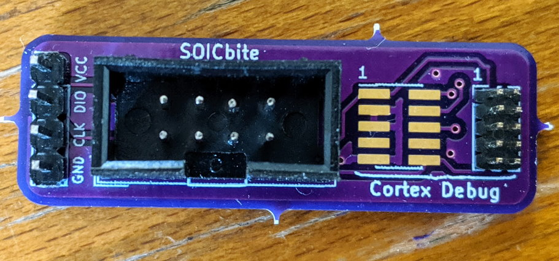

# SOICbite SWD Breakout

SOICbite to SWD breakout board:

1. Standard Cortex Debug connector - VCC, GND, SWDIO, SWCLK, SWO and NRST pins are broken out
2. 4-Pin 2.54" Header - VCC, SWDIO, SWCLK, GND are broken out

## 3D Renders

## Images

